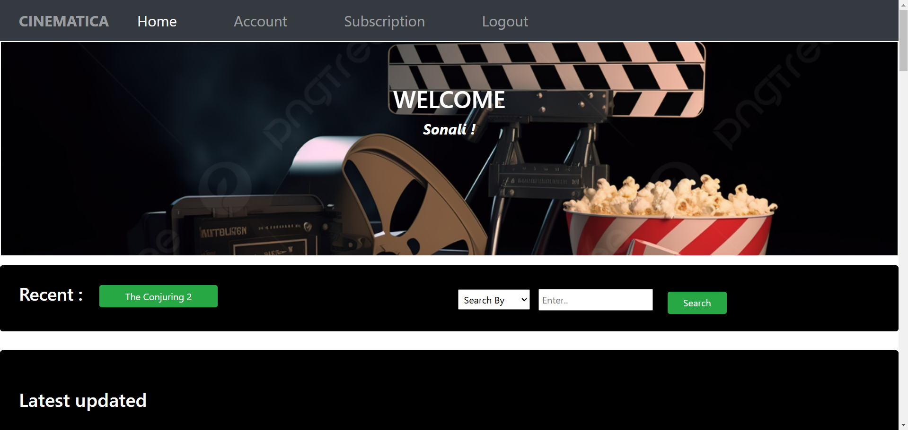
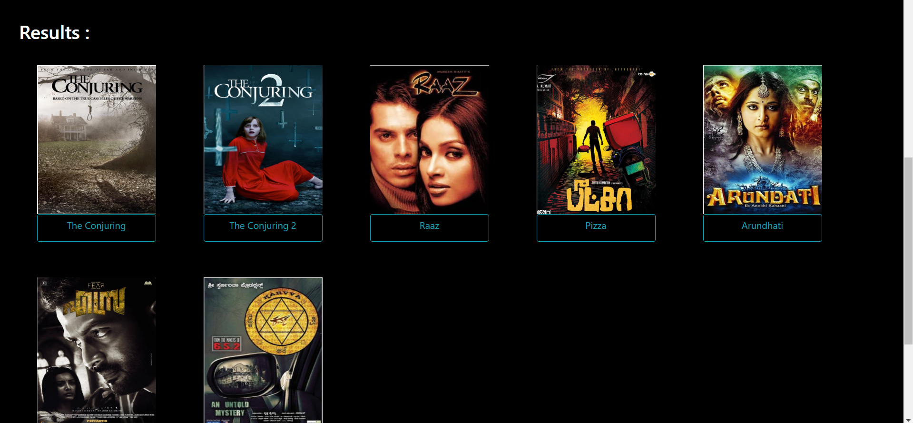
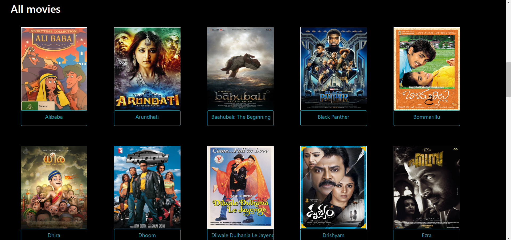
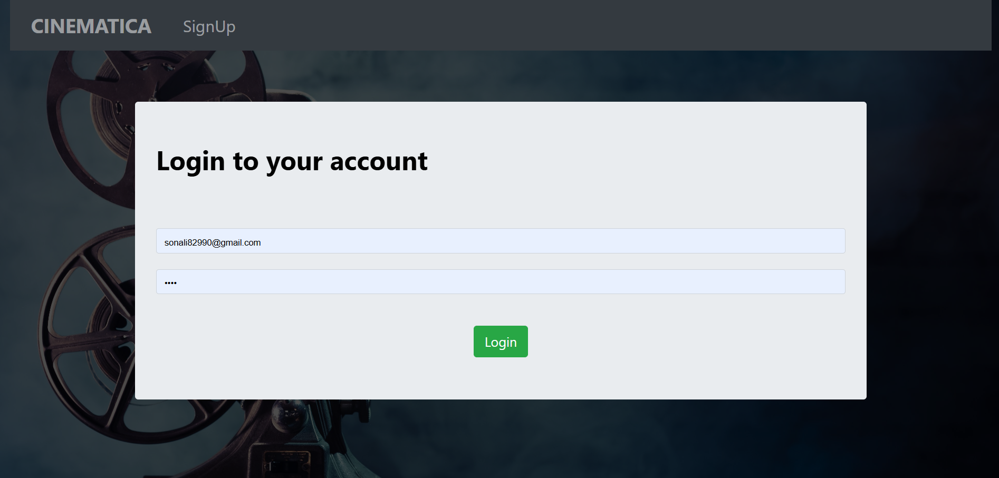
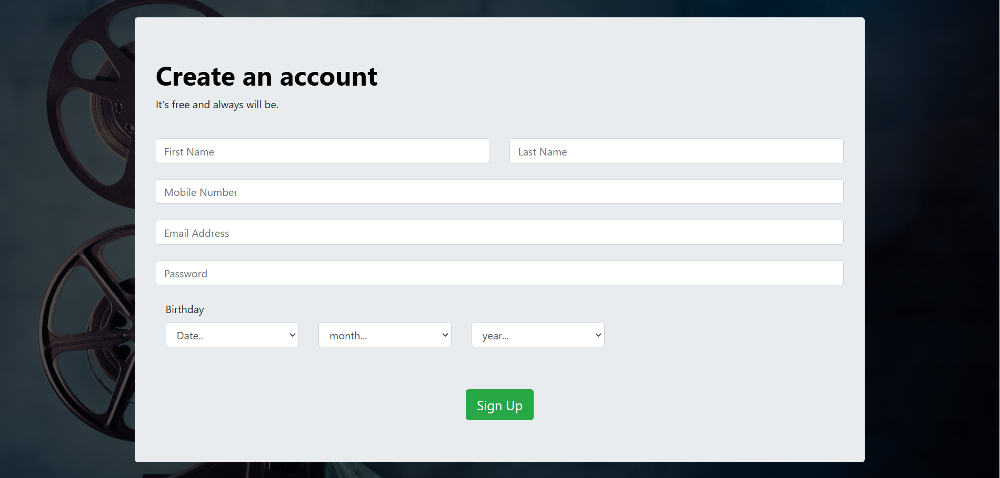
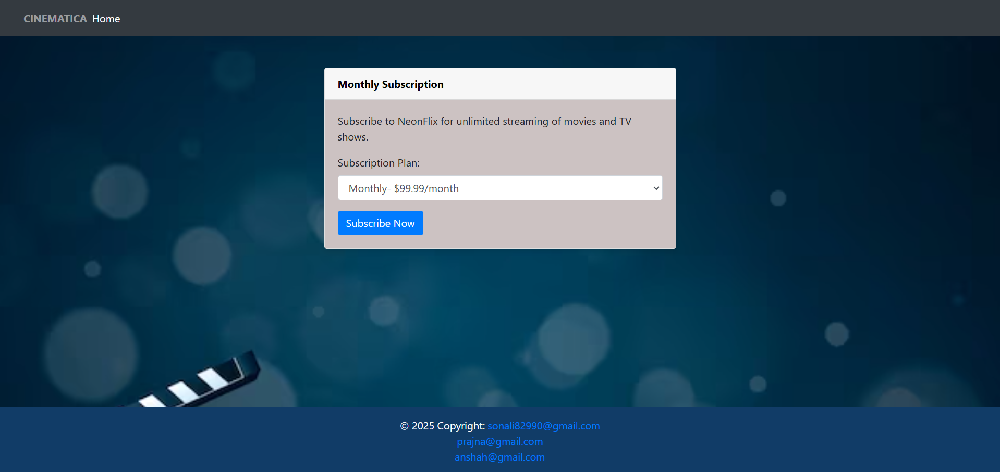

# 🎬 Cinematica

A Database Management System for an OTT Streaming Platform  
Built with **PHP**, **MySQL**, **HTML**, **CSS**, and **JavaScript**

---

## 🚀 Overview

**Cinematica** is a fully functional OTT (Over-The-Top) streaming platform developed as a part of a database management system project. It simulates a real-world streaming service where users can browse, search, watch trailers, rate, and review movies or shows across various languages and genres.  
The platform also includes a **genre-based recommendation system** that suggests content tailored to the user's viewing preferences.

---

## 🛠️ Tech Stack

- **Frontend**: HTML, CSS, JavaScript  
- **Backend**: PHP  
- **Database**: MySQL  
- **Other Tools**: XAMPP / WAMP for local server setup

---

## 🎯 Features

- ✅ User Registration & Login  
- ✅ Movie/Series Browsing  
- ✅ Genre & Language Filtering  
- ✅ Search Functionality   
- ✅ Ratings & Reviews  
- ✅ Admin Panel for Content Management  
- ✅ Genre-Based Recommendation System  

---

## 📸 Screenshots

### 🏠 Homepage



### 🎯 Genre-Based Recommendations



### 🎬 Movie Details Page



### 🔐 Sign In Page



### 📝 Sign Up Page



### 💳 Subscription Page



### 🛠️ Admin Panel


---

## 📦 Installation & Setup

### 🖥️ Prerequisites

- [XAMPP]
- PHP & MySQL installed

### 🔧 Steps

1. Clone or download this repository:
   ```bash
   git clone https://github.com/your-username/cinematica.git


